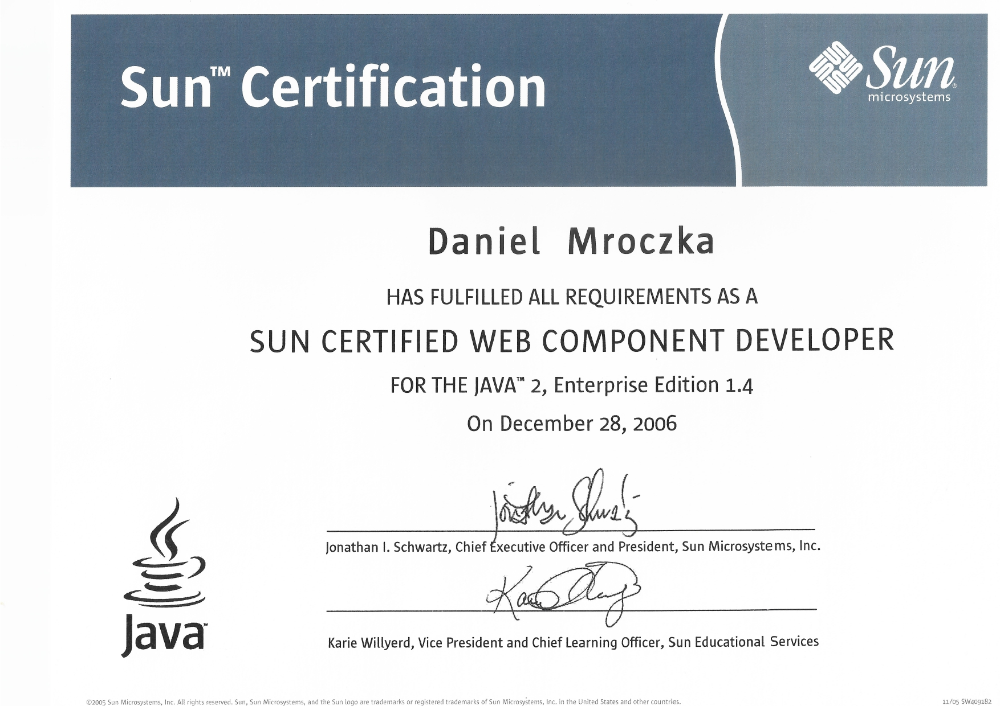
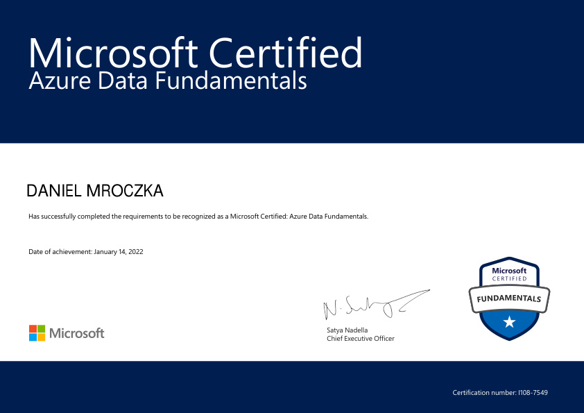
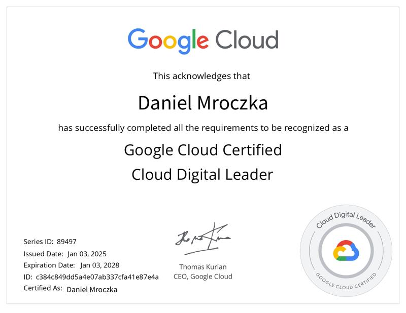
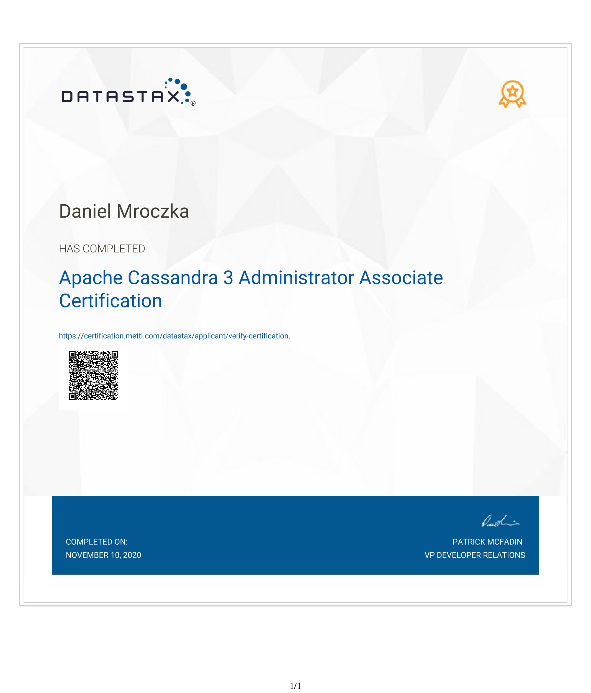

= List of certifications

== Java

=== Sun Certified Programmer for the Java 2 Standard Edition 5.0

image::java/SCJP.jpg[Java 5 SCJP,800,800]

=== Sun Certified Web Component Developer for Java 2 Enterprise Edition 1.4

=== Sun Certified Specialist for NetBeans IDE

image::java/SCS.jpg[Java Netbeans,800,800]

=== Oracle Certified Professional, Java EE 5 Business Component Developer

link:https://www.credly.com/earner/earned/badge/0b94ae5c-5e82-412a-84e5-7c1171b7153f[credly]

image::java/OCP BCD.jpg[Java BCD,800,800]

=== Oracle Certified Expert EE 6 Web Services Developer

link:https://www.credly.com/badges/51e532ef-7f09-46ca-b6a3-4d4176bdbe19[credly]

=== Oracle Certified Expert, Java EE 6 Java Persistence API Developer

link:https://www.credly.com/badges/aa0d6291-56ad-417f-91f9-6d4cf844a7c2[credly]

== Cloud

=== AWS

==== AWS Certified Cloud Practitioner

link:https://www.credly.com/badges/dc6f2ef8-b3ed-4795-971e-d35ab2d34794[credly]

=== Alibaba

==== Alibaba Cloud Associate

link:https://www.credly.com/badges/1f927914-89c0-444d-9c6f-875bb234e625[credly]

=== Azure

==== Microsoft Certified: Azure Fundamentals AZ900

link:https://www.credly.com/badges/1f927914-89c0-444d-9c6f-875bb234e625[credly]

image::cloud/azure/Microsoft_Certified_Professional_Certificate_AZ900.jpg[Azure Fundamentals AZ900,800,800]

==== Microsoft Certified: Azure Data Fundamentals DP900

link:https://www.credly.com/badges/2539522c-c2ef-4993-8a51-35e46dca58aa[credly]

==== Microsoft Certified: Azure AI Fundamentals AI900

link:https://www.credly.com/badges/4838eee3-682c-42c3-ad59-b9e24ddc1128[credly]

image::cloud/azure/Microsoft_Certified_Professional_Certificate_AI900.jpg[Azure Fundamentals AI900,800,800]

==== Microsoft Certified: Azure Security Engineer Associate SC900

link:https://www.credly.com/badges/1f927914-89c0-444d-9c6f-875bb234e625[credly]

image::cloud/azure/Microsoft_Certified_Professional_Certificate_SC900.jpg[Azure Fundamentals SC900,800,800]

=== GCP

==== Google Cloud Associate Cloud Engineer (ACE)

link:https://www.credly.com/badges/3928fced-2baa-4df4-89ae-9a2576148c99[credly]

==== Google Cloud Certified Professional Cloud Network Engineer (PCNE)

link:https://www.credly.com/earner/earned/badge/caee1b20-d174-4910-9c9f-3302b4b68a6b[credly]

==== Google Cloud Certified Professional Cloud Architect (PCA)

link:https://www.credly.com/badges/eee9b667-de36-471b-a92e-082b6d641013[credly]

==== Google Cloud Certified Professional Cloud Developer (PCD)

link:https://www.credly.com/badges/62e0e809-994b-4c37-ace6-b2a948bc71f6[credly]

==== Google Cloud Certified Professional Machine Learning Engineer (MLE)

link:https://www.credly.com/badges/6b09a2d3-24be-482c-ab99-e0ee1da75bab[credly]

==== Google Cloud Certified Cloud Digital Leader (CDL)

link:https://www.credly.com/badges/ffe42c37-3da5-4bfe-8686-54028689ed61[credly]

==== Google Cloud Certified Generative AI Leader (GAIL)

link:https://www.credly.com/badges/66c2e5b0-bee6-42e6-b5d7-40b3d25ef0d9[credly]

image::cloud/gcp/Google Cloud GAIL.jpg[GCP GAIL,800,800]

=== OCI

==== Oracle Cloud Infrastructure 2021 Foundations Associate

==== Oracle Cloud Infrastructure 2024 Foundations Associate

==== Oracle Cloud Infrastructure 2024 AI Foundations Associate

==== Oracle Cloud Infrastructure Developer Associate

==== Oracle Cloud Infrastructure Architect Associate

==== Oracle Cloud Infrastructure Architect Professional

== DevOps

=== Kubernetes

==== Certified Kubernetes Application Developer (CKAD)

link:https://www.credly.com/badges/ec590442-6498-4f47-838a-6a151fef7d3e[credly]

image::devops/daniel-mroczka-74a247a5-e4ae-4eb1-80ef-5278cd6b09e7.jpg[CKAD,800,800]

== Other

=== Apache Cassandra

==== Apache Cassandra 3 Administrator Associate

==== Apache Cassandra 3 Developer Associate

image::other/Developer-applicant-certificate-645098.jpg[Apache Cassandra,800,800]

=== Vaadin

==== Vaadin 10 Developer

link:https://vaadin.com/learn/certificate/9cbe6d05-6991-4567-913c-eaede8f96761[credly]

==== Vaadin 10 Professional

==== Vaadin 14 Developer

==== Vaadin 14 Professional

==== Vaadin 24 Developer

image::vaadin/Vaadin 24 Developer.jpg[Vaadin 24 Developer,800,800]

=== Neo4j

==== Neo4j Certified Professional

==== Neo4j 4.0 Certified

=== Github

==== GitHub Foundations

link:https://www.credly.com/badges/7f1c093b-5c00-458e-82fb-c3b095532848[credly]

image::other/GitHubFoundations_Badge20240801.jpg[Github,800,800]

=== Scaled Agile Framework (SAFe)

==== Certified SAFe 4 Practitioner

link:https://www.credly.com/earner/earned/badge/b8a56bfd-d931-4150-8761-1a4a8deb03d5[credly]

=== ChromeOS Administrator

