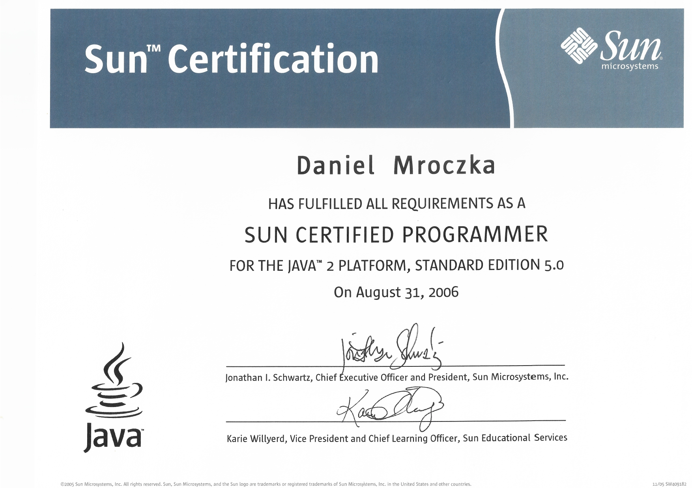
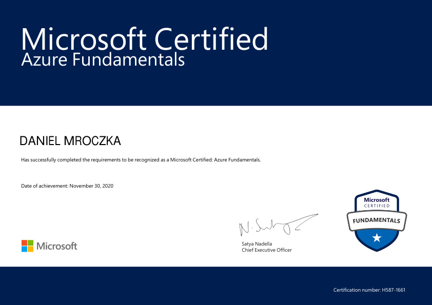
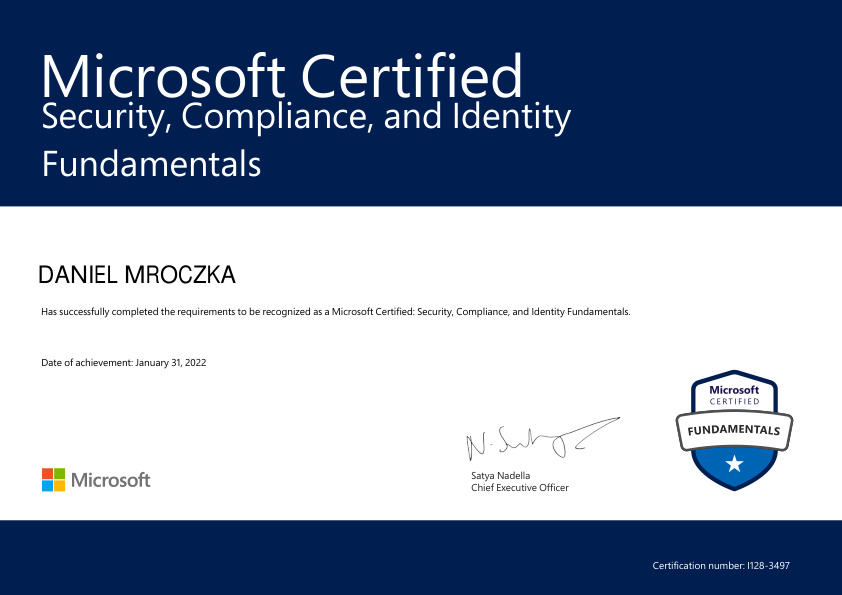
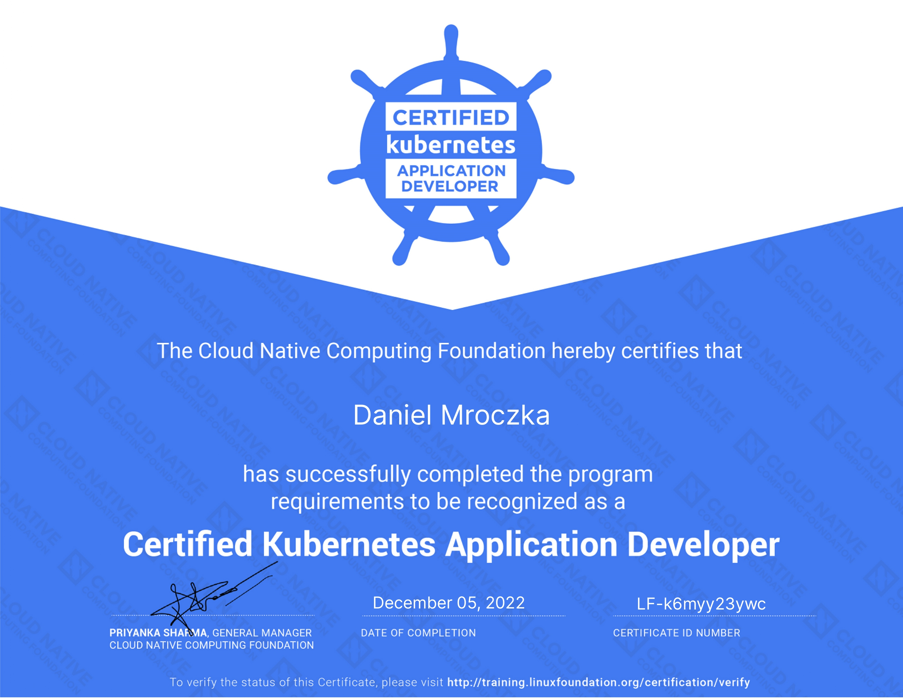

= List of certifications

* xref:java[Java]
** xref:sun-certified-programmer-for-the-java-2-standard-edition-50[Sun Certified Programmer for the Java 2 Standard Edition 5.0]
** xref:sun-certified-web-component-developer-for-java-2-enterprise-edition-14[Sun Certified Web Component Developer for Java 2 Enterprise Edition 1.4]
** xref:sun-certified-specialist-for-netbeans-ide[Sun Certified Specialist for NetBeans IDE]
** xref:oracle-certified-professional-java-ee-5-business-component-developer[Oracle Certified Professional, Java EE 5 Business Component Developer]
** xref:oracle-certified-expert-ee-6-web-services-developer[Oracle Certified Expert EE 6 Web Services Developer]
** xref:oracle-certified-expert-java-ee-6-java-persistence-api-developer[Oracle Certified Expert, Java EE 6 Java Persistence API Developer]
* xref:cloud[Cloud]
** xref:aws[AWS]
*** xref:aws-certified-cloud-practitioner[AWS Certified Cloud Practitioner]
** xref:alibaba[Alibaba]
*** xref:alibaba-cloud-associate[Alibaba Cloud Associate]
** xref:azure[Azure]
*** xref:microsoft-certified-azure-fundamentals-az900[Microsoft Certified: Azure Fundamentals AZ900]
*** xref:microsoft-certified-azure-data-fundamentals-dp900[Microsoft Certified: Azure Data Fundamentals DP900]
*** xref:microsoft-certified-azure-ai-fundamentals-ai900[Microsoft Certified: Azure AI Fundamentals AI900]
*** xref:microsoft-certified-azure-security-engineer-associate-sc900[Microsoft Certified: Azure Security Engineer Associate SC900]
** xref:gcp[GCP]
*** xref:google-cloud-associate-cloud-engineer-ace[Google Cloud Associate Cloud Engineer]
*** xref:google-cloud-certified-professional-cloud-network-engineer-pcne[Google Cloud Certified Professional Cloud Network Engineer]
*** xref:google-cloud-certified-professional-cloud-architect-pca[Google Cloud Certified Professional Cloud Architect]
*** xref:google-cloud-certified-professional-cloud-developer-pcd[Google Cloud Certified Professional Cloud Developer]
*** xref:google-cloud-certified-professional-machine-learning-engineer-mle[Google Cloud Certified Professional Machine Learning Engineer]
*** xref:google-cloud-certified-cloud-digital-leader-cdl[Google Cloud Certified Cloud Digital Leader]
*** xref:google-cloud-certified-generative-ai-leader-gail[Google Cloud Certified Generative AI Leader]
*** xref:google-cloud-certified-professional-data-engineer[Google Cloud Certified Professional Data Engineer]
** xref:oci[OCI]
*** xref:oracle-cloud-infrastructure-2021-foundations-associate[Oracle Cloud Infrastructure 2021 Foundations Associate]
*** xref:oracle-cloud-infrastructure-2024-foundations-associate[Oracle Cloud Infrastructure 2024 Foundations Associate]
*** xref:oracle-cloud-infrastructure-2024-ai-foundations-associate[Oracle Cloud Infrastructure 2024 AI Foundations Associate]
*** xref:oracle-cloud-infrastructure-developer-associate[Oracle Cloud Infrastructure Developer Associate]
*** xref:oracle-cloud-infrastructure-architect-associate[Oracle Cloud Infrastructure Architect Associate]
*** xref:oracle-cloud-infrastructure-architect-professional[Oracle Cloud Infrastructure Architect Professional]
* xref:devops[DevOps]
** xref:certified-kubernetes-application-developer-ckad[Certified Kubernetes Application Developer (CKAD)]
* xref:other[Other]
** xref:apache-cassandra[Apache Cassandra]
*** xref:apache-cassandra-3-administrator-associate[Apache Cassandra 3 Administrator Associate]
*** xref:apache-cassandra-3-developer-associate[Apache Cassandra 3 Developer Associate]
** xref:vaadin[Vaadin]
*** xref:vaadin-10-developer[Vaadin 10 Developer]
*** xref:vaadin-10-professional[Vaadin 10 Professional]
*** xref:vaadin-14-developer[Vaadin 14 Developer]
*** xref:vaadin-14-professional[Vaadin 14 Professional]
*** xref:vaadin-24-developer[Vaadin 24 Developer]
** xref:neo4j[Neo4j]
*** xref:neo4j-certified-professional[Neo4j Certified Professional]
*** xref:neo4j-40-certified[Neo4j 4.0 Certified]
** xref:github[Github]
*** xref:github-foundations[GitHub Foundations]
** xref:scaled-agile-framework-safe[Scaled Agile Framework (SAFe)]
** xref:chromeos-administrator[ChromeOS Administrator]

[[java]]
== Java

=== Sun Certified Programmer for the Java 2 Standard Edition 5.0

=== Sun Certified Web Component Developer for Java 2 Enterprise Edition 1.4

image::java/SCWCD.jpg[Java SCWCD,width=800]

=== Sun Certified Specialist for NetBeans IDE

image::java/SCS.jpg[Java Netbeans,width=800]

=== Oracle Certified Professional, Java EE 5 Business Component Developer link:https://www.credly.com/earner/earned/badge/0b94ae5c-5e82-412a-84e5-7c1171b7153f[credly]

image::java/OCP%20BCD.jpg[Java BCD,width=800]

=== Oracle Certified Expert EE 6 Web Services Developer link:https://www.credly.com/badges/51e532ef-7f09-46ca-b6a3-4d4176bdbe19[credly]

image::java/OCE%20WSD.jpg[Java WSD,width=800]

=== Oracle Certified Expert, Java EE 6 Java Persistence API Developer link:https://www.credly.com/badges/aa0d6291-56ad-417f-91f9-6d4cf844a7c2[credly]

image::java/OCE%20JPA.jpg[Java JPA,width=800]

[[cloud]]
== Cloud

[[aws]]
=== AWS

==== AWS Certified Cloud Practitioner link:https://www.credly.com/badges/dc6f2ef8-b3ed-4795-971e-d35ab2d34794[credly]

image::cloud/aws/AWS%20Certified%20Cloud%20Practitioner%20certificate.jpg[AWS Practitioner,width=800]

[[alibaba]]
=== Alibaba

==== Alibaba Cloud Associate link:https://www.credly.com/badges/1f927914-89c0-444d-9c6f-875bb234e625[credly]

image::cloud/alibaba/AlibabaCloud%20ACA%20certificate.jpg[Alibaba Cloud Associate,width=800]

[[azure]]
=== Azure

==== Microsoft Certified: Azure Fundamentals AZ900 link:https://www.credly.com/badges/1f927914-89c0-444d-9c6f-875bb234e625[credly]

==== Microsoft Certified: Azure Data Fundamentals DP900 link:https://www.credly.com/badges/2539522c-c2ef-4993-8a51-35e46dca58aa[credly]

image::cloud/azure/Microsoft_Certified_Professional_Certificate_DP900.jpg[Azure Fundamentals DP900,width=800]

==== Microsoft Certified: Azure AI Fundamentals AI900 link:https://www.credly.com/badges/4838eee3-682c-42c3-ad59-b9e24ddc1128[credly]

image::cloud/azure/Microsoft_Certified_Professional_Certificate_AI900.jpg[Azure Fundamentals AI900,width=800]

==== Microsoft Certified: Azure Security Engineer Associate SC900 link:https://www.credly.com/badges/1f927914-89c0-444d-9c6f-875bb234e625[credly]

[[gcp]]
=== GCP

==== Google Cloud Associate Cloud Engineer (ACE) link:https://www.credly.com/badges/3928fced-2baa-4df4-89ae-9a2576148c99[credly]

image::cloud/gcp/Google%20Cloud%20ACE.jpg[GCP ACE,width=800]

==== Google Cloud Certified Professional Cloud Network Engineer (PCNE) link:https://www.credly.com/earner/earned/badge/caee1b20-d174-4910-9c9f-3302b4b68a6b[credly]

image::cloud/gcp/Google%20Cloud%20Network%20Engineer.jpg[GCP PCNE,width=800]

==== Google Cloud Certified Professional Cloud Architect (PCA) link:https://www.credly.com/badges/eee9b667-de36-471b-a92e-082b6d641013[credly]

image::cloud/gcp/Google%20Cloud%20PCA.jpg[GCP PCA,width=800]

==== Google Cloud Certified Professional Cloud Developer (PCD) link:https://www.credly.com/badges/62e0e809-994b-4c37-ace6-b2a948bc71f6[credly]

image::cloud/gcp/Google%20Cloud%20PCD.jpg[GCP PCD,width=800]

==== Google Cloud Certified Professional Machine Learning Engineer (MLE) link:https://www.credly.com/badges/6b09a2d3-24be-482c-ab99-e0ee1da75bab[credly]

image::cloud/gcp/Google%20Cloud%20Machine%20Learning.jpg[GCP MLE,width=800]

==== Google Cloud Certified Cloud Digital Leader (CDL) link:https://www.credly.com/badges/ffe42c37-3da5-4bfe-8686-54028689ed61[credly]

image::cloud/gcp/Google%20Cloud%20CDL.jpg[GCP CDL,width=800]

==== Google Cloud Certified Generative AI Leader (GAIL) link:https://www.credly.com/badges/66c2e5b0-bee6-42e6-b5d7-40b3d25ef0d9[credly]

image::cloud/gcp/Google%20Cloud%20GAIL.jpg[GCP GAIL,width=800]

==== Google Cloud Certified Professional Data Engineer (PDE) link:https://www.credly.com/badges/fcbf109d-ec98-4042-8f05-36f7a54607bf[credly]

image::cloud/gcp/Google Cloud PDE.jpg[GCP PDE,width=800]

[[oci]]
=== OCI

==== Oracle Cloud Infrastructure 2021 Foundations Associate

image::cloud/oci/OCI%20Foundations%20Associate%20Certificate.jpg[OCI Foundations,width=800]

==== Oracle Cloud Infrastructure 2024 Foundations Associate

image::cloud/oci/OCI%202024%20Foundations%20Associate.jpg[OCI Foundations,width=800]

==== Oracle Cloud Infrastructure 2024 AI Foundations Associate

image::cloud/oci/OCI%202024%20AI%20Foundations%20Associate.jpg[OCI Foundations,width=800]

==== Oracle Cloud Infrastructure Developer Associate

image::cloud/oci/OCI%20Developer%20Associate%20Certificate.jpg[OCI Foundations,width=800]

==== Oracle Cloud Infrastructure Architect Associate

image::cloud/oci/OCI%20Associate%20Architect.jpg[OCI Foundations,width=800]

==== Oracle Cloud Infrastructure Architect Professional

image::cloud/oci/OCI%20Professional%20Architect%20Certificate.jpg[OCI Foundations,width=800]

[[devops]]
== DevOps

=== Kubernetes

==== Certified Kubernetes Application Developer (CKAD) link:https://www.credly.com/badges/ec590442-6498-4f47-838a-6a151fef7d3e[credly]

[[other]]
== Other

[[apache-cassandra]]
=== Apache Cassandra

==== Apache Cassandra 3 Administrator Associate

image::other/Administrator-applicant-certificate-645947.jpg[Apache Cassandra,width=800]

==== Apache Cassandra 3 Developer Associate

image::other/Developer-applicant-certificate-645098.jpg[Apache Cassandra,width=800]

[[vaadin]]
=== Vaadin

==== Vaadin 10 Developer link:https://vaadin.com/learn/certificate/9cbe6d05-6991-4567-913c-eaede8f96761[credly]

image::vaadin/Vaadin%2010%20Developer.jpg[Vaadin 10 Developer,width=800]

==== Vaadin 10 Professional link:https://vaadin.com/learn/certificate/113290e8-892c-4800-adeb-444745cf2762[credly]

image::vaadin/Vaadin%2010%20Professional.jpg[Vaadin 10 Professional,width=800]

==== Vaadin 14 Developer link:https://vaadin.com/learn/certificate/092c64e3-c8dd-46a2-a33a-75f1c4f19174[credly]

image::vaadin/Vaadin%2014%20Developer.jpg[Vaadin 14 Developer,width=800]

==== Vaadin 14 Professional link:https://vaadin.com/learn/certificate/6d2d0215-e181-4561-98a8-a181414ca3b7[credly]

image::vaadin/Vaadin%2014%20Professional.jpg[Vaadin 14 Professional,width=800]

==== Vaadin 24 Developer link:https://vaadin.com/learn/certificate/86f866d4-d85f-4104-a7a0-62fb8896c161[credly]

image::vaadin/Vaadin%2024%20Developer.jpg[Vaadin 24 Developer,width=800]

[[neo4j]]
=== Neo4j

==== Neo4j Certified Professional

image::other/Neo4j%20Certified%20Professional.jpg[Neo4j,width=800]

==== Neo4j 4.0 Certified

image::other/Neo4j%204.0%20Certified.jpg[Neo4j,width=800]

[[github]]
=== Github

==== GitHub Foundations link:https://www.credly.com/badges/7f1c093b-5c00-458e-82fb-c3b095532848[credly]

image::other/GitHubFoundations_Badge20240801.jpg[Github,width=800]

[[scaled-agile-framework-safe]]
=== Scaled Agile Framework (SAFe)

==== Certified SAFe 4 Practitioner link:https://www.credly.com/earner/earned/badge/b8a56bfd-d931-4150-8761-1a4a8deb03d5[credly]

image::other/Certified%20SAFe%204%20Practitioner.jpg[Safe,width=800]

=== ChromeOS Administrator link:https://chromeoscertified.accredible.com/bce27b9d-648a-4975-9743-4ac7674d1240#acc.b5stEpFY[credly]

image::other/Google%20ChromeOS%20Administrator.jpg[Google ChromeOS Administrator,width=800]