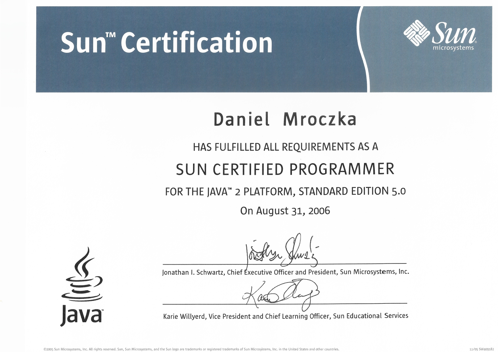
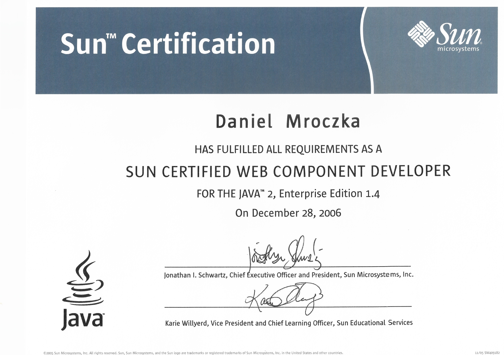
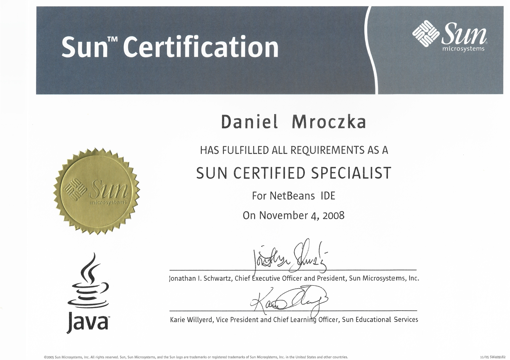
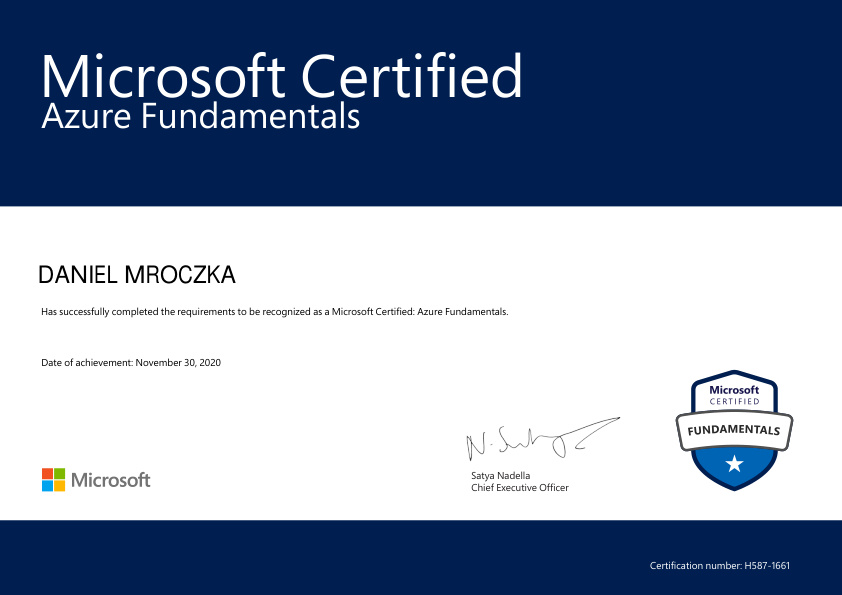
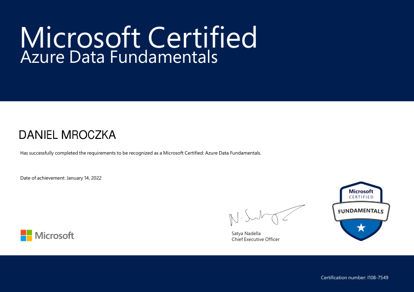
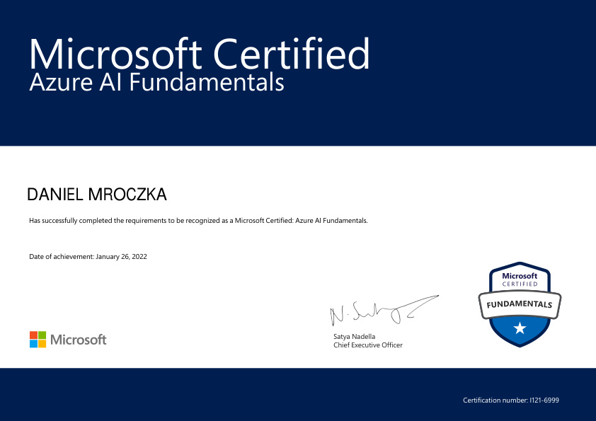
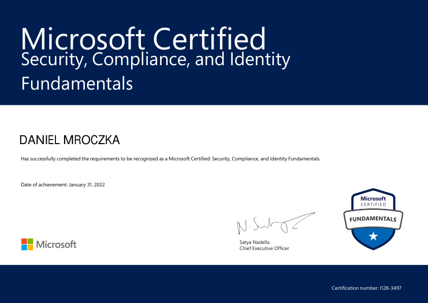
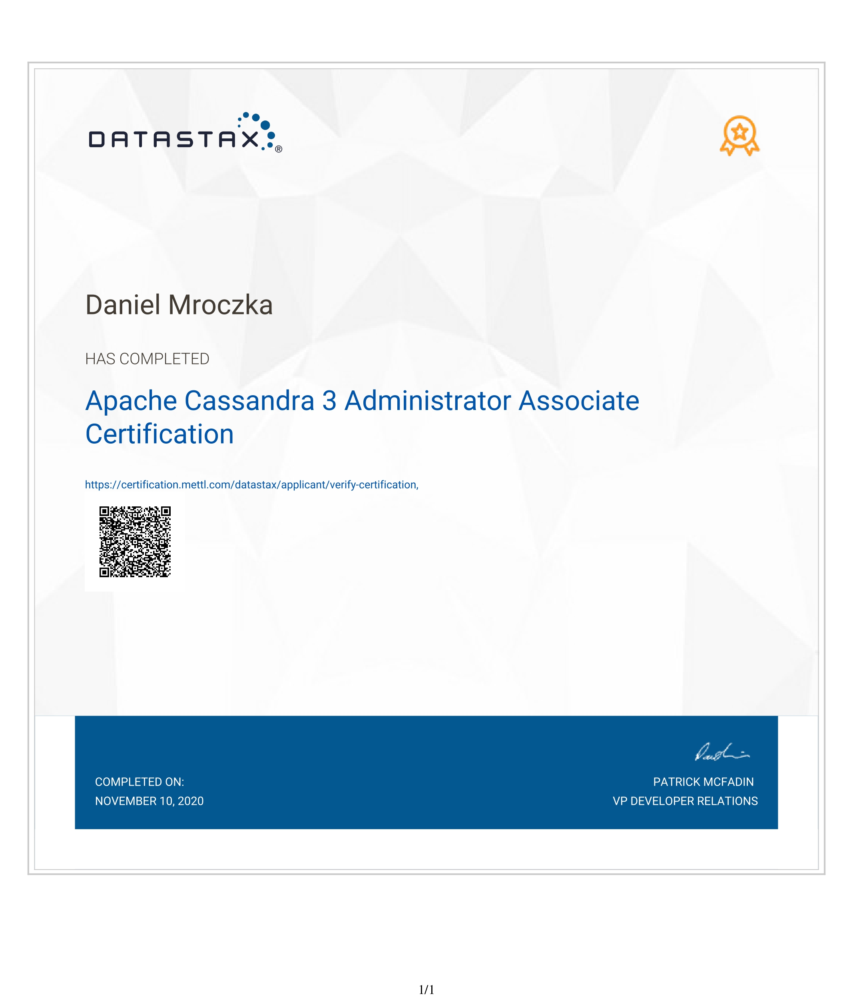
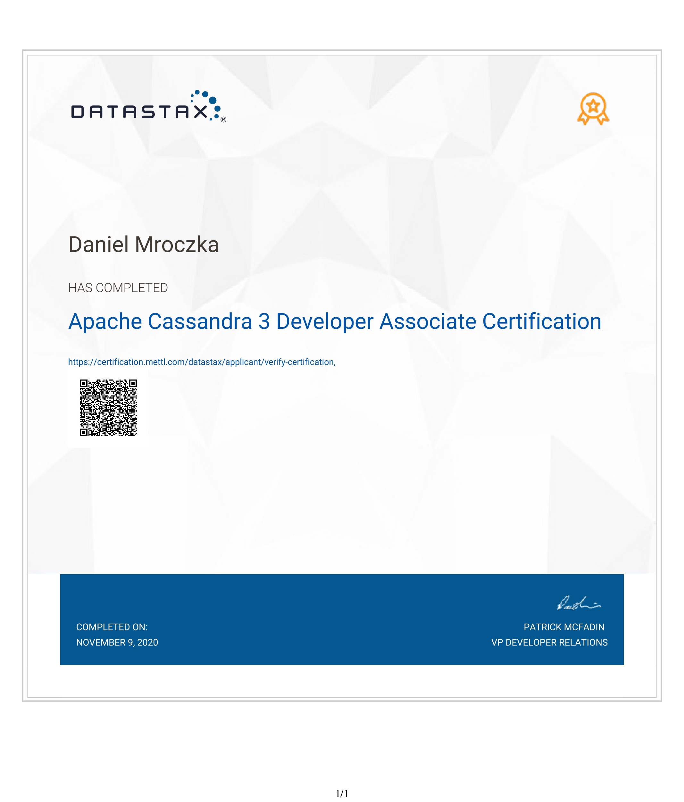
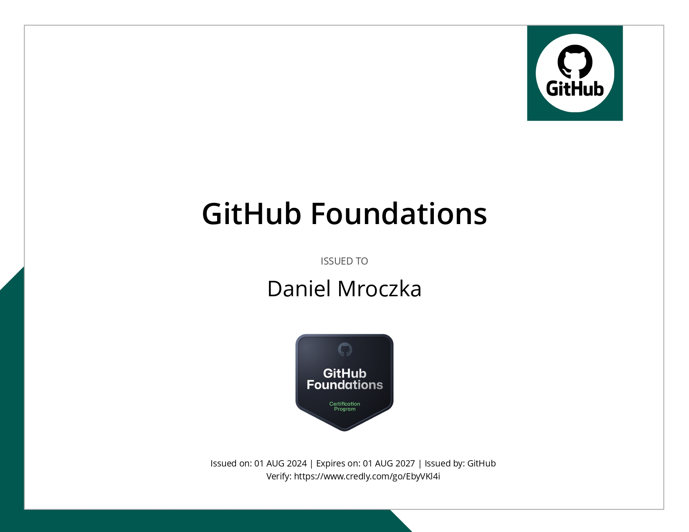

# List of certifications

- [Java](#java)
    - [Sun Certified Programmer for the Java 2 Standard Edition 5.0](#sun-certified-programmer-for-the-java-2-standard-edition-50)
    - [Sun Certified Web Component Developer for Java 2 Enterprise Edition 1.4](#sun-certified-web-component-developer-for-java-2-enterprise-edition-14)
    - [Sun Certified Specialist for NetBeans IDE](#sun-certified-specialist-for-netbeans-ide)
    - [Oracle Certified Professional, Java EE 5 Business Component Developer](#oracle-certified-professional-java-ee-5-business-component-developer-credly)
    - [Oracle Certified Expert EE 6 Web Services Developer](#oracle-certified-expert-ee-6-web-services-developer-credly)
    - [Oracle Certified Expert, Java EE 6 Java Persistence API Developer](#oracle-certified-expert-java-ee-6-java-persistence-api-developer-credly)
- [Cloud](#cloud)
    - [AWS](#aws)
        - [AWS Certified Cloud Practitioner](#aws-certified-cloud-practitioner-credly)
    - [Alibaba](#alibaba)
        - [Alibaba Cloud Associate](#alibaba-cloud-associate-credly)
    - [Azure](#azure)
        - [Microsoft Certified: Azure Fundamentals AZ900](#microsoft-certified-azure-fundamentals-az900-credly)
        - [Microsoft Certified: Azure Data Fundamentals DP900](#microsoft-certified-azure-data-fundamentals-dp900-credly)
        - [Microsoft Certified: Azure AI Fundamentals AI900](#microsoft-certified-azure-ai-fundamentals-ai900-credly)
        - [Microsoft Certified: Azure Security Engineer Associate SC900](#microsoft-certified-azure-security-engineer-associate-sc900-credly)
    - [GCP](#gcp)
        - [Google Cloud Associate Cloud Engineer](#google-cloud-associate-cloud-engineer-credly)
        - [Google Cloud Certified Professional Cloud Network Engineer](#google-cloud-certified-professional-cloud-network-engineer-credly)
        - [Google Cloud Certified Professional Cloud Architect](#google-cloud-certified-professional-cloud-architect-credly)
        - [Google Cloud Certified Professional Cloud Developer](#google-cloud-certified-professional-cloud-developer-credly)
        - [Google Cloud Certified Professional Machine Learning Engineer](#google-cloud-certified-professional-machine-learning-engineer-credly)
        - [Google Cloud Certified Cloud Digital Leader](#google-cloud-certified-cloud-digital-leader-credly)
    - [OCI](#oci)
        - [Oracle Cloud Infrastructure 2021 Foundations Associate](#oracle-cloud-infrastructure-2021-foundations-associate)
        - [Oracle Cloud Infrastructure 2024 Foundations Associate](#oracle-cloud-infrastructure-2024-foundations-associate)
        - [Oracle Cloud Infrastructure 2024 AI Foundations Associate](#oracle-cloud-infrastructure-2024-ai-foundations-associate)
        - [Oracle Cloud Infrastructure Developer Associate](#oracle-cloud-infrastructure-developer-associate)
        - [Oracle Cloud Infrastructure Architect Associate](#oracle-cloud-infrastructure-architect-associate)
        - [Oracle Cloud Infrastructure Architect Professional](#oracle-cloud-infrastructure-architect-professional)
- [DevOps](#devops)
    - [Certified Kubernetes Application Developer (CKAD)](#certified-kubernetes-application-developer-ckad-credly)
- [Other](#other)
    - [Apache Cassandra](#apache-cassandra)
        - [Apache Cassandra 3 Administrator Associate](#apache-cassandra-3-administrator-associate)
        - [Apache Cassandra 3 Developer Associate](#apache-cassandra-3-developer-associate)
    - [Vaadin](#vaadin)
        - [Vaadin 10 Developer](#vaadin-10-developer)
        - [Vaadin 10 Professional](#vaadin-10-professional)
        - [Vaadin 14 Developer](#vaadin-14-developer)
        - [Vaadin 14 Professional](#vaadin-14-professional)
    - [Neo4j](#neo4j)
        - [Neo4j Certified Professional](#neo4j-certified-professional)
        - [Neo4j 4.0 Certified](#neo4j-40-certified)
    - [Github](#github)
        - [GitHub Foundations](#github-foundations-credly)
    - [Scaled Agile Framework (SAFe)](#scaled-agile-framework-safe)
    - [ChromeOS Administrator](#ChromeOS-Administrator)

---

## Java

#### Sun Certified Programmer for the Java 2 Standard Edition 5.0

#### Sun Certified Web Component Developer for Java 2 Enterprise Edition 1.4

#### Sun Certified Specialist for NetBeans IDE

#### Oracle Certified Professional, Java EE 5 Business Component Developer [credly](https://www.credly.com/earner/earned/badge/0b94ae5c-5e82-412a-84e5-7c1171b7153f)

#### Oracle Certified Expert EE 6 Web Services Developer [credly](https://www.credly.com/badges/51e532ef-7f09-46ca-b6a3-4d4176bdbe19)

#### Oracle Certified Expert, Java EE 6 Java Persistence API Developer [credly](https://www.credly.com/badges/aa0d6291-56ad-417f-91f9-6d4cf844a7c2)

## Cloud

### AWS

#### AWS Certified Cloud Practitioner [credly](https://www.credly.com/badges/dc6f2ef8-b3ed-4795-971e-d35ab2d34794)

### Alibaba

#### Alibaba Cloud Associate [credly](https://www.credly.com/badges/1f927914-89c0-444d-9c6f-875bb234e625)

### Azure

#### Microsoft Certified: Azure Fundamentals AZ900 [credly](https://www.credly.com/badges/1f927914-89c0-444d-9c6f-875bb234e625)

#### Microsoft Certified: Azure Data Fundamentals DP900 [credly](https://www.credly.com/badges/2539522c-c2ef-4993-8a51-35e46dca58aa)

#### Microsoft Certified: Azure AI Fundamentals AI900 [credly](https://www.credly.com/badges/4838eee3-682c-42c3-ad59-b9e24ddc1128)

#### Microsoft Certified: Azure Security Engineer Associate SC900 [credly](https://www.credly.com/badges/1f927914-89c0-444d-9c6f-875bb234e625)

### GCP

#### Google Cloud Associate Cloud Engineer (ACE) [credly](https://www.credly.com/badges/3928fced-2baa-4df4-89ae-9a2576148c99)

#### Google Cloud Certified Professional Cloud Network Engineer (PCNE) [credly](https://www.credly.com/earner/earned/badge/caee1b20-d174-4910-9c9f-3302b4b68a6b)

#### Google Cloud Certified Professional Cloud Architect (PCA) [credly](https://www.credly.com/badges/eee9b667-de36-471b-a92e-082b6d641013)

#### Google Cloud Certified Professional Cloud Developer (PCD) [credly](https://www.credly.com/badges/62e0e809-994b-4c37-ace6-b2a948bc71f6)

#### Google Cloud Certified Professional Machine Learning Engineer (MLE) [credly](https://www.credly.com/badges/6b09a2d3-24be-482c-ab99-e0ee1da75bab)

#### Google Cloud Certified Cloud Digital Leader (CDL) [credly](https://www.credly.com/badges/ffe42c37-3da5-4bfe-8686-54028689ed61)

### OCI

#### Oracle Cloud Infrastructure 2021 Foundations Associate

#### Oracle Cloud Infrastructure 2024 Foundations Associate

#### Oracle Cloud Infrastructure 2024 AI Foundations Associate

#### Oracle Cloud Infrastructure Developer Associate

#### Oracle Cloud Infrastructure Architect Associate

#### Oracle Cloud Infrastructure Architect Professional

## DevOps

### Kubernetes

#### Certified Kubernetes Application Developer (CKAD) [credly](https://www.credly.com/badges/ec590442-6498-4f47-838a-6a151fef7d3e)

## Other

### Apache Cassandra

#### Apache Cassandra 3 Administrator Associate

#### Apache Cassandra 3 Developer Associate

### Vaadin

#### Vaadin 10 Developer [credly](https://vaadin.com/learn/certificate/9cbe6d05-6991-4567-913c-eaede8f96761)

#### Vaadin 10 Professional

#### Vaadin 14 Developer

#### Vaadin 14 Professional

### Neo4j

#### Neo4j Certified Professional

#### Neo4j 4.0 Certified

### Github

#### GitHub Foundations [credly](https://www.credly.com/badges/7f1c093b-5c00-458e-82fb-c3b095532848)

### Scaled Agile Framework (SAFe)

#### Certified SAFe 4 Practitioner [credly](https://www.credly.com/earner/earned/badge/b8a56bfd-d931-4150-8761-1a4a8deb03d5)

#### ChromeOS Administrator

 
