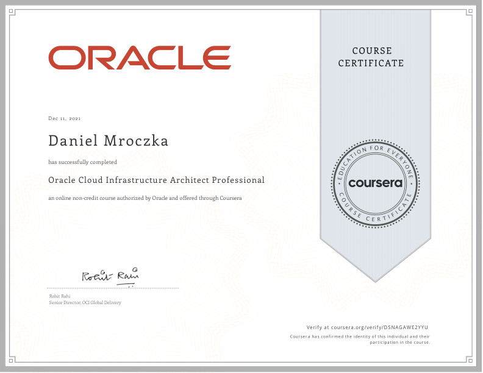
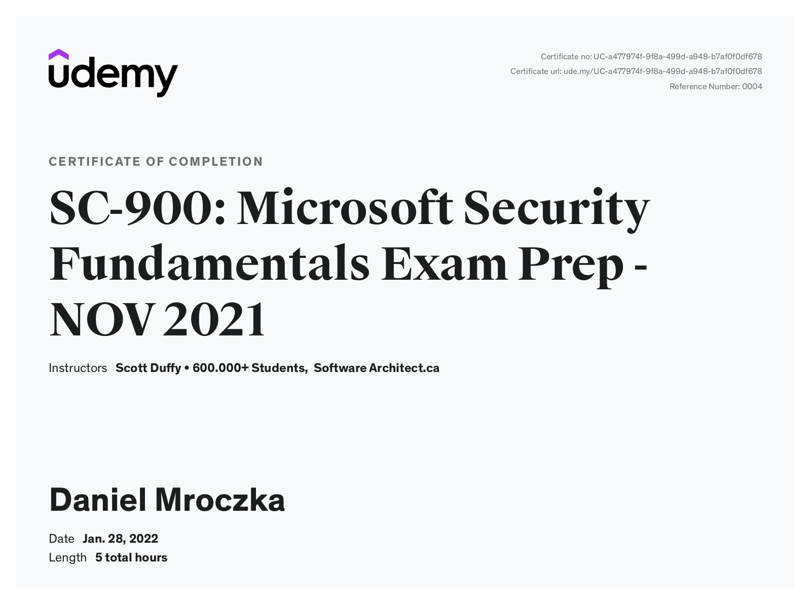
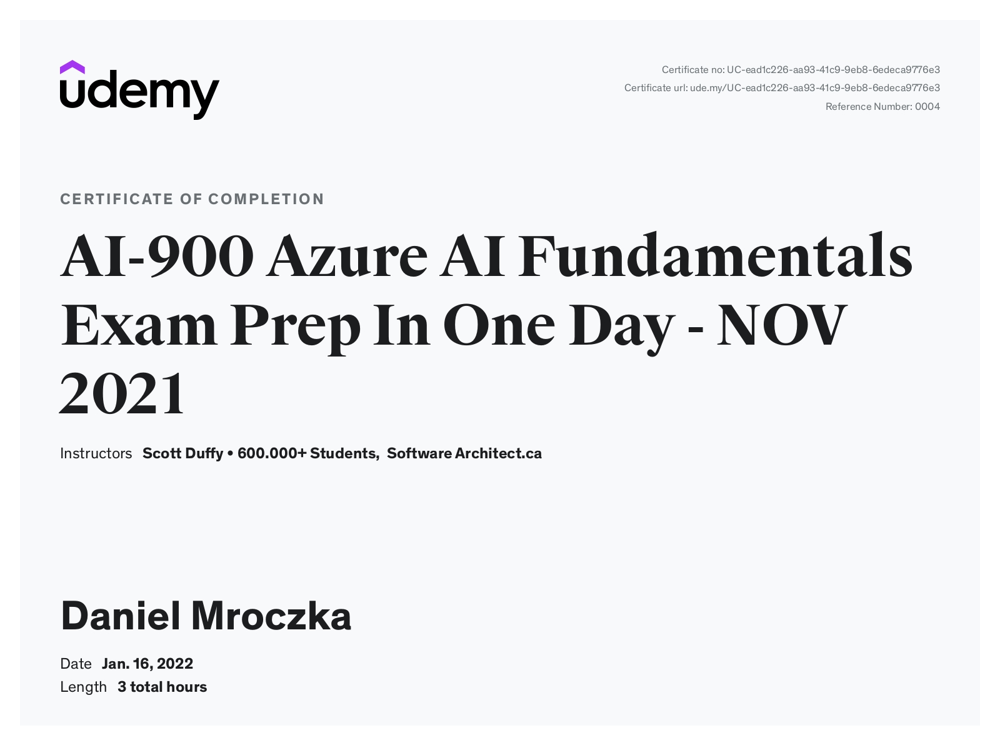
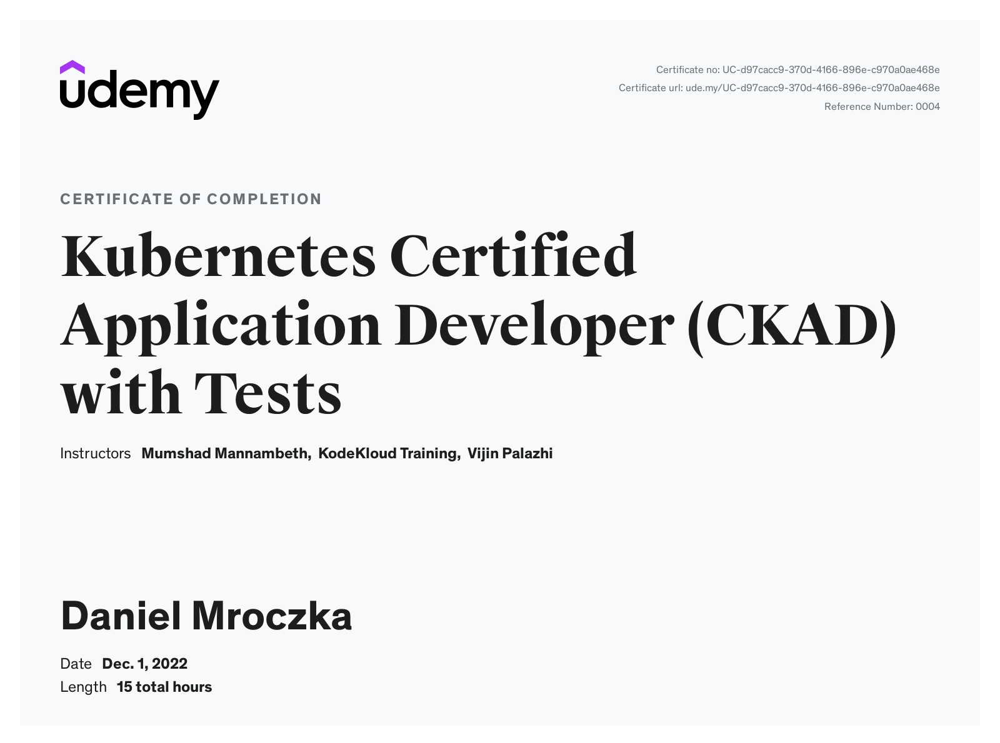
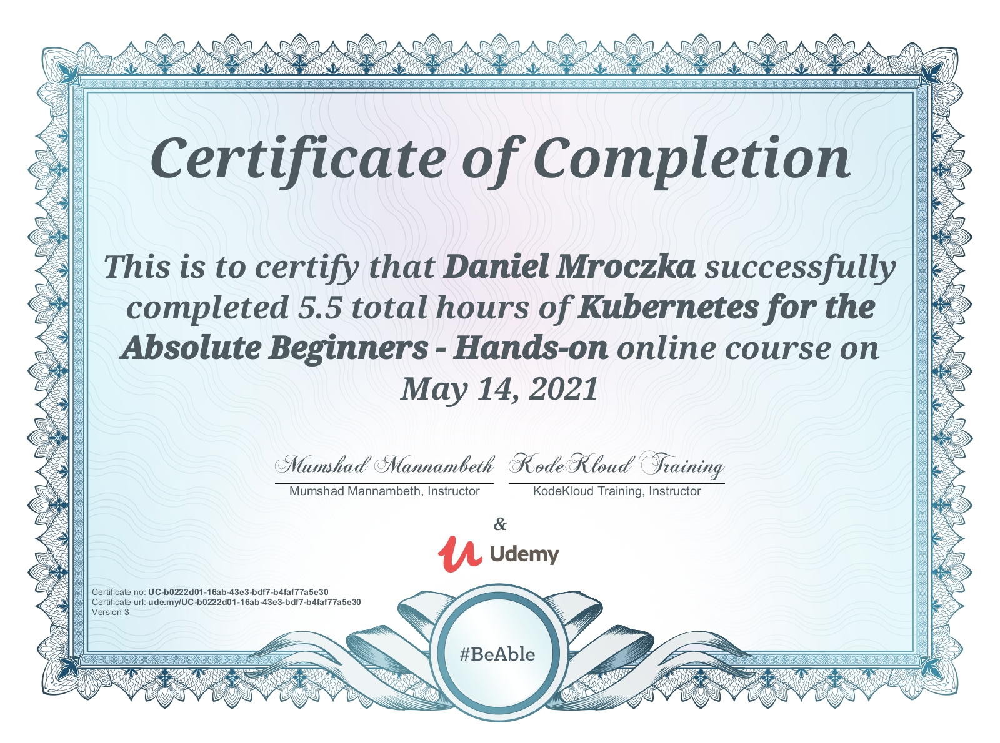

# Trainings

## Coursera

https://www.coursera.org/account/accomplishments/verify/D2M6V39KDCCA

## Udemy

## MongoDB

%20-%20Trainings_page-0001.jpg)

%20-%20Trainings_page-0002.jpg)

%20-%20Trainings_page-0003.jpg)