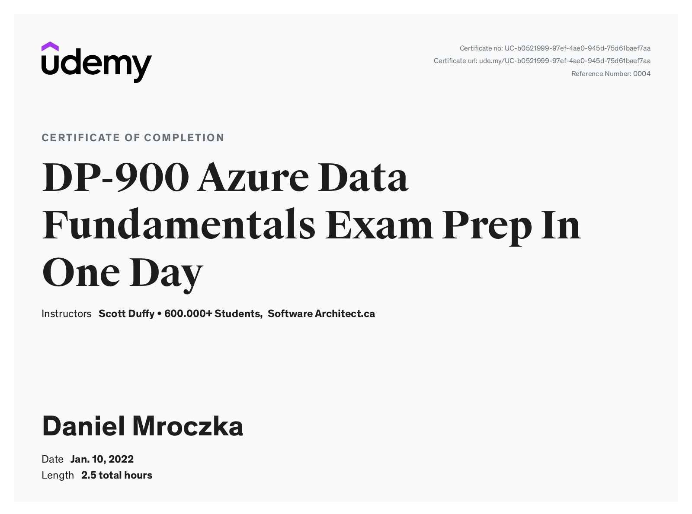
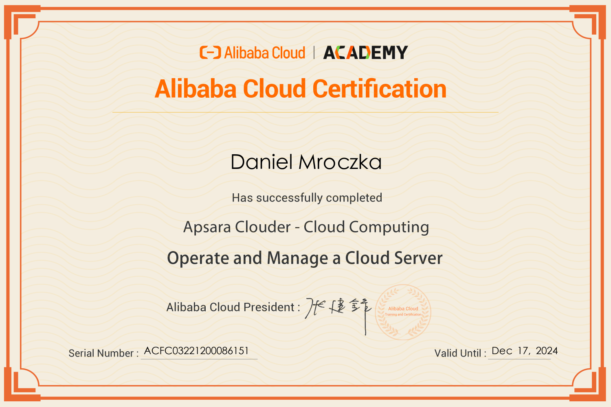
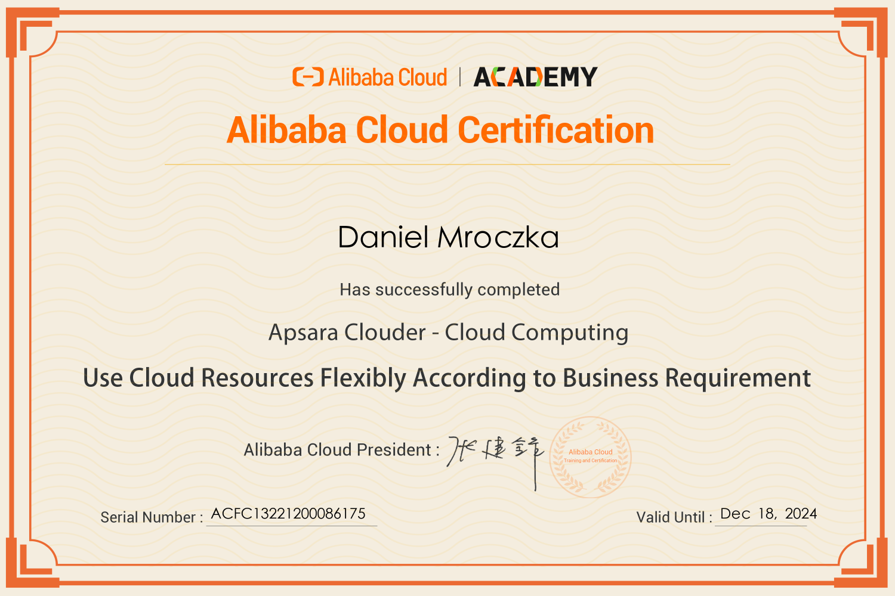
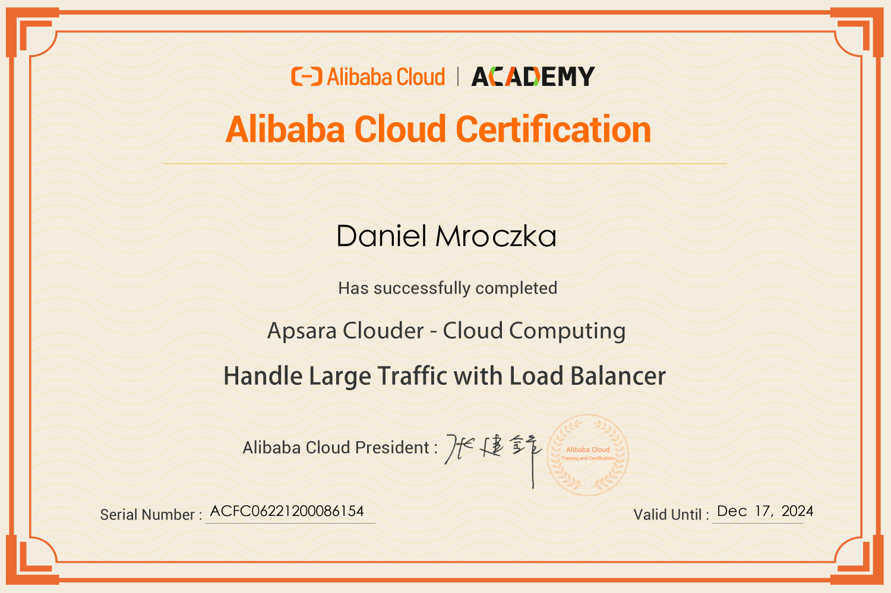
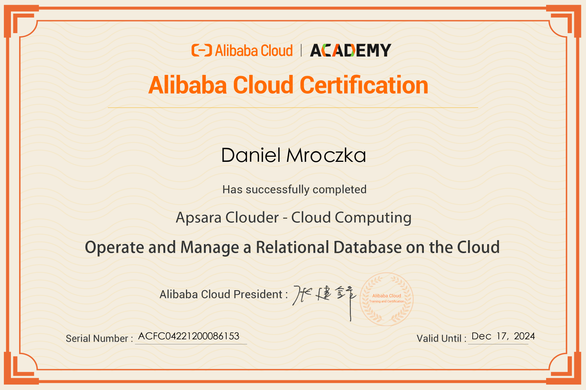
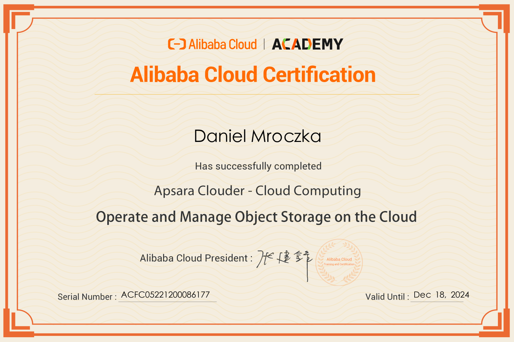

# Professional Training Certifications

- [Coursera](#coursera)
- [Udemy](#udemy)
- [Google Cloud Platform (GCP)](#gcp)
- [MongoDB](#mongodb)
- [A Cloud Guru](#cloud-guru)
- [Alibaba Cloud](#alibaba)
- [Other Trainings](#other)

## Coursera

### Functional Programming Principles in Scala [Verify](https://www.coursera.org/verify/H8R6X44QBM2R)

### Oracle Cloud Infrastructure Architect Associate [Verify](https://www.coursera.org/verify/DZCT32XW5864)

### Oracle Cloud Infrastructure Architect Professional [Verify](https://www.coursera.org/verify/DSNAGAWE2YYU)

### Kotlin for Java Developers [Verify](https://www.coursera.org/verify/8YV7UD9FHRY3)

### AWS Cloud Practitioner Essentials [Verify](https://www.coursera.org/verify/D2M6V39KDCCA)

### Introduction to AI and Machine Learning on Google Cloud [Verify](https://www.coursera.org/verify/T447FN2RA5PK)

### Google AI Essentials [Verify](https://www.coursera.org/account/P63ZZL1MEUG4)

## Udemy

### SC-900: Microsoft Security Fundamentals Exam Preparation [Verify](http://ude.my/UC-a477974f-9f8a-499d-a948-b7af0f0df678)

### AI-900L Azure AI Fundamentals Exam Preparation [Verify](http://ude.my/UC-ead1c226-aa93-41c9-9eb8-6edeca9776e3)

### DP-900 Azure Data Fundamentals Exam Preparation [Verify](http://ude.my/UC-b0521999-97ef-4ae0-945d-75d61baef7aa)

### Docker Crash Course for busy DevOps and Developers [Verify](http://ude.my/UC-f1f40599-ff5e-45cb-ac5d-431dfbc430ff)

### Kubernetes Certified Application Developer (CKAD) [Verify](http://ude.my/UC-d97cacc9-370d-4166-896e-c970a0ae468e)

### Kubernetes for Absolute Beginners - Hands-on [Verify](http://ude.my/UC-b0222d01-16ab-43e3-bdf7-b4faf77a5e30)

## Google Cloud Platform (GCP)

### Google Cloud Fundamentals: Core Infrastructure 2022

### Google Cloud Fundamentals: Core Infrastructure 2024

### Getting Started with Google Kubernetes Engine 2024

### Google Cloud Platform Big Data and Machine Learning Fundamentals 2024

### Google Cloud Fundamentals: Cloud Digital Leader 2024

### Google Cloud Fundamentals: Big Data and Machine Learning 2024

### Google Cloud Fundamentals: Core Infrastructure 2025

### Introduction to Data Analytics on Google Cloud 2025

### Getting Started with Terraform for Google Cloud 2025

### Introduction to Data Engineering on Google Cloud 2025

### Getting Started with Google Kubernetes Engine 2025

## MongoDB

### M102: MongoDB for DBAs

%20-%20Trainings_page-0001.jpg)

### M101J: MongoDB for Java Developers

%20-%20Trainings_page-0002.jpg)

### M101JS: MongoDB for Node.js Developers

%20-%20Trainings_page-0003.jpg)

## A Cloud Guru

### Introduction to Google Cloud [Verify](https://verify.acloud.guru/DCCF2D768E89)

%20-%20Trainings_page-0024.jpg)

### Google Cloud Certified Associate Cloud Engineer [Verify](https://verify.acloud.guru/D1269D28BD23)

%20-%20Trainings_page-0025.jpg)

### Crash Course on Google Cloud Platform [Verify](https://verify.acloud.guru/F9EFEAE7E90F)

%20-%20Trainings_page-0026.jpg)

### Learn Google Cloud by Doing [Verify](https://verify.acloud.guru/7F534EC08964)

%20-%20Trainings_page-0027.jpg)

## Alibaba Cloud

### Operate and Manage a Cloud Server

### Use Cloud Resources Flexibly According to Business Requirement

### Handle Large Traffic with Load Balancer

### Operate and Manage a Relational Database on the Cloud

### Operate and Manage Object Storage on the Cloud

## Other

### Kotlin Expert Workshop

### Using AI in Business Development 1st Edition [Verify](https://cdn.umiejetnoscijutra.pl/certificates/67bced35-9cf9-4fa9-a9db-c13e81df3dc4)

### Using AI in Business Development 2nd Edition [Verify](https://cdn.umiejetnoscijutra.pl/certificates/67bced35-9cf9-4fa9-a9db-c13e81df3dc4)

